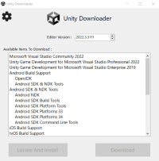
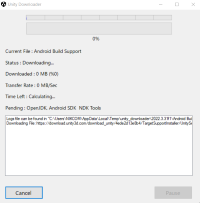

# Unity Downloader

[](LICENSE)

Unity Downloader is a C# Windows Forms application designed to simplify and enhance the Unity editor experience. This application automatically identifies the installed version of the Unity editor and provides options for downloading compatible tools and assets. Unlike Unity Hub, Unity Downloader supports chunk-based, parallel downloads, allowing for pause and resume functionality, ensuring that your downloads can continue from where they left off if your internet connection is interrupted.

## Features

- **Automatic Detection:** Identifies installed Unity editor versions.
- **Download Management:** Displays available tools and assets for the detected Unity version.
- **Chunk-Based Downloads:** Utilizes the Modified Version of [Downloader package by Bezzad](https://github.com/bezzad/Downloader) for efficient, reliable downloads.
- **Pause and Resume:** Supports resuming downloads after an interruption, preventing the need to restart from the beginning.
- **Automatic Installation:** Automatically installs downloaded tools and assets, simplifying the setup process.
- **Proxy and DNS Support:** Allows configuring proxy settings and custom DNS for enhanced download flexibility and speed.

## Screenshots


Main Screen


Download Screen

## Installation

1. **Clone the repository:**

    ```bash
    git clone https://github.com/amir1387aht/Unity-Downloader.git
    ```

2. **Open the project:**

    Open the project in Visual Studio.

3. **Build the project:**

    Build the solution to compile the application.

4. **Run the application:**

    Run the application from Visual Studio or the executable file in the `bin` directory.

## Usage

1. **Launch Unity Downloader:**

    Open the application. It will automatically detect installed Unity editor versions.

3. **Configure Proxy/DNS (Optional):**

    If needed, configure your proxy settings or custom DNS for optimized downloads.

2. **Select Tools/Assets:**

    Browse through the available tools and assets compatible with your Unity version.

3. **Download:**

    Select the items you want to download. The app will use chunk-based, parallel downloading to ensure efficient and reliable downloads.

4. **Install:**

    After downloading, Unity Downloader will automatically install the tools and assets, making them ready for use in your projects.

## Dependencies

- [Downloader package by Bezzad](https://github.com/bezzad/Downloader)

## Contributing

We welcome contributions! Please read our [contributing guidelines](CONTRIBUTING.md) for more details.

## License

This project is licensed under the MIT License. See the [LICENSE](LICENSE) file for details.

## Disclaimer

Unity Downloader is an independent project and is not affiliated with or endorsed by Unity Technologies. Use this application at your own risk. While we strive to provide a reliable tool, we are not responsible for any issues that may arise from using this application, including but not limited to data loss or corruption, download failures, or compatibility problems.

## Contact

For any questions or issues, please open an issue on GitHub or contact the maintainer at [amir1387aht@gmail.com] or on telegram at [@Do3p3iri](http://t.me/Do3p3iri).